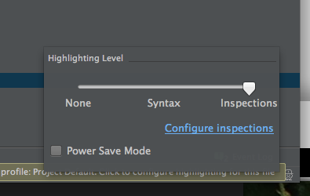
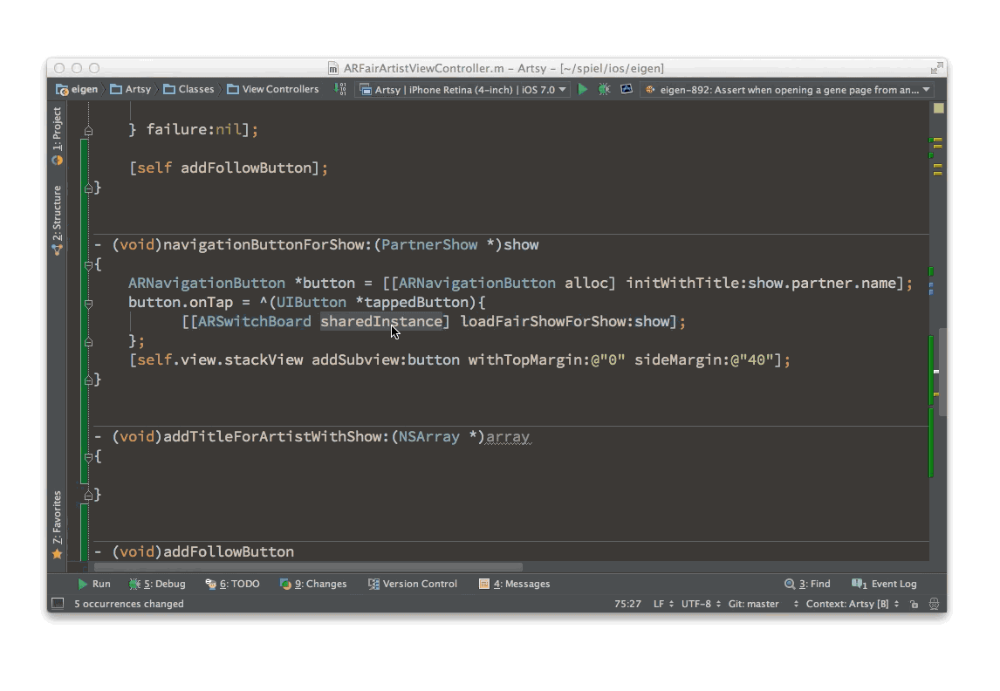
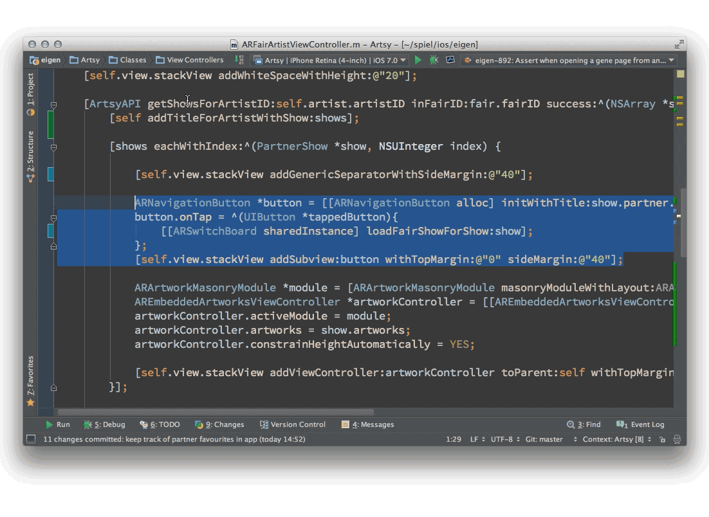

# Things I've liked

## adding_enum 

Auto prepends enum for enum based properties.

## blame-for-multiple-lines.png 

Allows you to select a few lines then see just their changes over time.

##contextual-variable-names.png 

Uses context to figure out smart variable names.

## create-property.png 

Lots of options on creating a property that you've referenced but not created.

## find-uses.png 

Super useful symbol search in the app.

## inline-showing-deletion.png 

See what's been deleted but not yet commited by clicking on the gutter.

## keypath-strings.png 

If you're using a keypath it will only advise keypaths as the strings values.

## needs-pod-install.png 

Change the podfile but not `pod install`/`pod update`d ? It'll tell you.

## not-used-functions.png 

Useful.

## outofdate-cocoapods.png 

Lets you know that more recent versions exist.

## renew.png 

Renew panel shows up in your console ( only once per app launch, not annoying. )

## scope-context.png 

Show the start of a context like `@interface` or the beginning of a method above the editor.

## shows-highlighted-text-over-stuff.png 

Show the details of a variable in lldb above the other tabs.

## spelling-in-comments.png 

Cute. Caught me out a few times.

## start-typing-midway.png 

Fuzzy.

## switcher.png 

Lists most recently edited files.

## tasks-providers.png 

Let AppCode use your issue tracker. Supports a bunch.

## tasks.png 

Start a task context based on your issue tracker from a fuzy completion of titles.

## unused-headers.png 

Shows what you don't need to import,

## Power saving mode

It will not do all the syntax hghlighting + symbolification if you want to have longer battery life.

## Resize selection in context

Hold alt and press up / down to jump up and down through the context.

## Extract Method

Take some code and finds all its dependencies. This is good for dependency injection too! Not how it took a the show as an arg, not by using the property later.